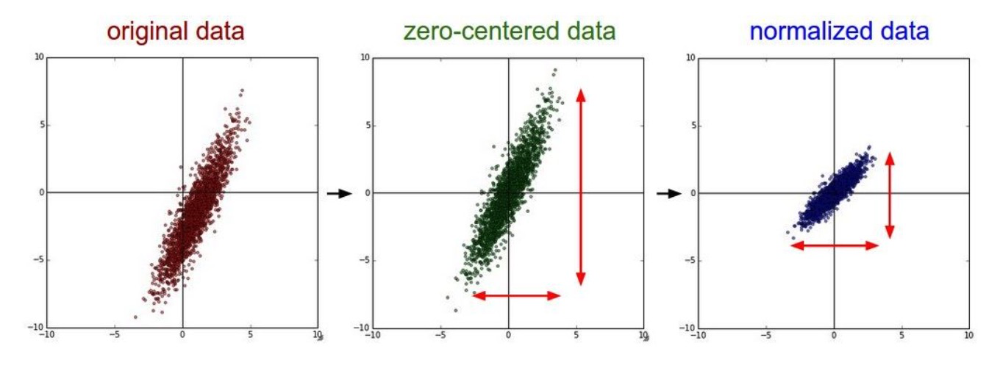

# 什么是数据中心化？

可以理解为把样本集的中心平移到坐标原点的位置，或理解为把坐标平移到样本集中心的位置，这个“中心”就是样本均值，因此容易理解平移后的样本均值为$\vec{0}$。

具体地，假设某一个样本为$\vec{x}_i$，共有$m$个样本，样本均值矢量记为$\vec{\mu}$，平移后的样本记为$\vec{\mathbf x}_i$，则
$$
\vec{\mathbf x}_i = \vec{x}_i-\vec{\mu}
$$
记平移后的均值为$\vec{\mu}'$，则
$$
\begin{aligned}
\vec{\mu}' &= \frac{1}{m}\sum_{i=1}^m\vec{\mathbf x}_i \\
&= \frac{1}{m}\sum_{i=1}^m\left(\vec{x}_i-\vec{\mu}\right) \\
&= \vec{0}
\end{aligned}
$$
以上就是中心化(Zero-Centered)处理，就是每个样本都减去均值矢量，很简单。

现在来进一步研究一下中心化处理后样本集的方差是否发生变化，假设原始样本集的方差矢量为$\vec{v}$，中心化处理后的样本集的方差矢量为$\vec{v}'$，特征维数为$d$，原坐标的单位正交基矢量为$\vec{e}_j$，$j=1,\cdots,d$，则
$$
\begin{aligned}
\vec{v} &= \sum_{j=1}^d\left(\frac{1}{m}\sum_{i=1}^m\left(\vec{x}_i-\vec{\mu}\right)\left(\vec{x}_i-\vec{\mu}\right)^T\circ \mathbf I\right)\vec{e}_j \\
&= \sum_{j=1}^d\left(\frac{1}{m}\sum_{i=1}^m\vec{\mathbf x}_i\vec{\mathbf x}_i^T\circ \mathbf I\right)\vec{e}_j\\
&= \vec{v}'
\end{aligned}
$$
其中$\mathbf I$为$d$阶单位方阵。

由以上简单分析知道数据中心化处理后方差是没有发生变化的，可以理解为所有样本整体进行平移，样本的离散程度没有发生任何变化，或者可以更简单的理解为所有样本点本身在空间中的位置没有变，只是坐标进行了平移，所以样本集整体的任何特性都不会发生变化，仅仅是表示它们的坐标发生了变化。

# 什么是数据标准化？

标准化(Normalization)方法有非常多种，一般情况下提及"标准化"默认是指经过标准化处理后所有特征的均值均为$0$，标准差均为$1$的标准化，也叫z-score标准化。由此可见，标准化是在中心化的基础上对标准差做了进一步处理，使得每一个特征的标准差均为$1$。

具体地，假设原始数据集的均值矢量记为$\vec{\mu}$，标准差矢量记为$\vec{\sigma}$，并且$\vec{\sigma}$的所有元素均为非$0$元素，某一个样本记为$\vec{x}_i$，标准化后的样本记为$\vec{\mathbf x}_i$，则对原始数据集的标准化可以定义为
$$
\vec{\mathbf x}_i\circ\vec{\sigma} = \vec{x}_i-\vec{\mu}
$$

假设原始数据集共有$m$个样本，记标准化后的均值矢量为$\vec{\mu}'$，则
$$
\begin{aligned}
\vec{\sigma}\circ\vec{\mu}' &= \vec{\sigma}\circ\frac{1}{m}\sum_{i=1}^m\vec{\mathbf x}_i\\
&= \frac{1}{m}\sum_{i=1}^m\left(\vec{\mathbf x}_i\circ\vec{\sigma}\right)\\
&= \frac{1}{m}\sum_{i=1}^m\left(\vec{x}_i-\vec{\mu}\right)\\
&= \vec{0}
\end{aligned}
$$
由于$\vec{\sigma}$的所有元素均为非$0$元素，因此$\vec{\mu}'=\vec{0}$，也就是说，标准化处理后所有特征的均值均为$0$。

现在来进一步研究一下标准化处理后样本集的方差是否发生变化，假设原始样本集的方差矢量为$\vec{v}=\vec{\sigma}\circ\vec{\sigma}$，标准化处理后的样本集的方差矢量为$\vec{v}'=\vec{\sigma}'\circ\vec{\sigma}'$，特征维数为$d$，原坐标的单位正交基矢量为$\vec{e}_j$，$j=1,\cdots,d$，则
$$
\begin{aligned}
\vec{v} &= \sum_{j=1}^d\left(\frac{1}{m}\sum_{i=1}^m\left(\vec{x}_i-\vec{\mu}\right)\left(\vec{x}_i-\vec{\mu}\right)^T\circ \mathbf I\right)\vec{e}_j \\
&= \sum_{j=1}^d\left(\frac{1}{m}\sum_{i=1}^m\left(\vec{\mathbf x}_i\circ\vec{\sigma}\right)\left(\vec{\mathbf x}_i\circ\vec{\sigma}\right)^T\circ \mathbf I\right)\vec{e}_j\\
&= \sum_{j=1}^d\left(\frac{1}{m}\sum_{i=1}^m\left(\vec{\mathbf x}_i\vec{\mathbf x}_i^T\right)\circ\left(\vec{\sigma}\vec{\sigma}^T\right)\circ \mathbf I\right)\vec{e}_j\\
&=\left(\frac{1}{m}\sum_{i=1}^m\left(\vec{\mathbf x}_i\vec{\mathbf x}_i^T\right)\circ\left(\vec{\sigma}\vec{\sigma}^T\right)\circ \mathbf I\right)\sum_{j=1}^d\vec{e}_j\\
&=\left(\frac{1}{m}\sum_{i=1}^m\left(\vec{\mathbf x}_i\vec{\mathbf x}_i^T\right)\circ\mathbf I\right)\circ\left(\left(\vec{\sigma}\vec{\sigma}^T\right)\circ \mathbf I\right)\sum_{j=1}^d\vec{e}_j\\
&=\left(\frac{1}{m}\sum_{i=1}^m\left(\vec{\mathbf x}_i\vec{\mathbf x}_i^T\right)\circ\mathbf I\sum_{j=1}^d\vec{e}_j\right)\circ\left(\left(\left(\vec{\sigma}\vec{\sigma}^T\right)\circ \mathbf I\right)\sum_{j=1}^d\vec{e}_j\right)\\
&=\vec{v}'\circ\vec{v}
\end{aligned}
$$
其中$\mathbf I$为$d$阶单位方阵。由以上推导可以看出$\vec{v}'$为元素全为$1$的矢量，也就是说，标准化后的所有特征的方差和标准差均为$1$。以下是原始数据，中心化后的数据和标准化后的数据在二维特征下的样本点分布图，可以看出中心化后的数据以坐标原点为对称中心，而标准化后的数据不仅以坐标原点为对称中心而且在各个维度上的离散程度是一样的。

经常看到网络上有一些博文提到标准化处理后的数据会服从标准正态分布，我对这个结论是非常质疑的，现在我尝试用最严谨的逻辑来研究一下这个问题。

首先，服从标准正态分布的数据确实是均值为$0$且标准差为$1$，但这只能说明均值为$0$且标准差为$1$是数据服从标准正态分布的必要条件，那么它是不是充分条件呢？

为了简单起见，这里暂时仅讨论特征为一维的情况，此时原始数据样本点记为$x$，均值记为$\mu$，非$0$标准差记为$\sigma$，标准化处理后的样本记为$\mathbf x$，则
$$
\mathbf x = \frac{x-\mu}{\sigma}
$$
假设原始数据$x$服从如下的正态分布
$$
f\left(x\right) = \frac{1}{\sqrt{2\pi}\sigma}\exp\left(-\frac{\left(x-\mu\right)^2}{2\sigma^2}\right)
$$
则标准化处理后$\mathbf x$的代数关系如下
$$
\begin{aligned}
f\left(\sigma \mathbf x+\mu\right) &= \frac{1}{\sqrt{2\pi}\sigma}\exp\left(-\frac{(\sigma \mathbf x+\mu-\mu)^2}{2\sigma^2}\right)\\
&= \frac{1}{\sigma}\frac{1}{\sqrt{2\pi}}\exp\left(-\frac{\mathbf x^2}{2}\right)\\
&=\frac{1}{\sigma}g\left(\mathbf x\right)
\end{aligned}
$$
也即
$$
\sigma f\left(x\right) = g\left(\mathbf x\right)=\frac{1}{\sqrt{2\pi}}\exp\left(-\frac{\mathbf x^2}{2}\right)
$$
由以上推导可以看出，标准化处理本质上是在做$x$轴方向上的平移变换和伸缩变换，为了使标准化处理后的变量$\mathbf x$能够符合标准正态分布，还需要对原始数据所服从的正态分布曲线的$y$轴方向做$\sigma$倍的伸缩变换。

因此得出结论，尽管原始数据服从正态分布，仅通过标准化处理后的变量是不符合标准正态分布的，除非原始数据服从正态分布且标准差为$1$，因为标准差为$1$代表原始数据服从的正态分布曲线在$y$轴方向上不需要变换。因此标准化处理后的变量不一定服从标准正态分布。

# 什么是数据归一化？

